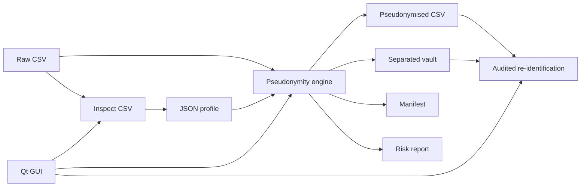

# Pseudonymity


Pseudonymity is a configurable data pseudonymisation toolkit for privacy engineering work. It is both a command-line tool and an importable Python library. Optionally, it can be used also through a QT-based GUI.

It supports JSON profiles, deterministic HMAC-SHA256 tokenisation, masking, generalisation, perturbation, vault-backed re-identification, accountability manifests and risk screening. It also includes an optional Go risk engine component for k-anonymity-style checks.

## Why Pseudonymity Exists

Pseudonymisation is often discussed as a single technical move: replace direct identifiers with tokens and call the dataset safer. Real projects are messier. Identifiers need different treatments, quasi-identifiers still carry singling-out risk, re-identification must be governed, and teams need evidence of what happened to each field.

Pseudonymity is built around that reality. It treats pseudonymisation as a repeatable engineering workflow:

1. inspect the source dataset;
2. describe field-level treatment in a profile;
3. transform the analytical output;
4. separate additional information into a vault;
5. generate a manifest and risk report;
6. re-identify only through an explicit, auditable path.

The same workflow is available from the CLI, from the Python API, and from the optional native Qt GUI.

## Interfaces

| Interface | Audience | Purpose |
| --- | --- | --- |
| CLI | Privacy engineers, data engineers, CI jobs | Repeatable batch pseudonymisation, risk reports, audit-friendly workflows. |
| Python library | Developers and platform teams | Embed the engine in internal data platforms or services. |
| Qt GUI | Analysts, reviewers, demo users | Native desktop workflow for running demos, selecting files, inspecting CSVs and performing governed recovery. |
| Go risk engine | Future performance/isolation path | Optional standalone k-anonymity-style screening engine. |

## Core Principles

- Pseudonymised data may still be personal data when re-identification is possible.
- HMAC tokens are not decrypted; re-identification is performed through a separated vault.
- Direct identifiers and quasi-identifiers both require explicit treatment.
- Profiles make pseudonymisation policy visible, reviewable and repeatable.
- Risk reports are screening signals, not anonymisation guarantees.
- Re-identification should be a governed operation with approvals, audit logs and least privilege.

## Processing Model



## Requirements

- Python 3.11+
- CLI examples use the local source-tree shim `python .\pseudonymise.py`
- Maintenance scripts are Bash scripts under `scripts/`
- Go 1.22+ only if you want to build the optional Go risk engine

The Python core has no third-party runtime dependencies.

## Run From Source

```powershell
python .\pseudonymise.py --help
```

`pseudonymise.py` is the documented CLI entrypoint for local source-tree usage. The package also exposes the same functionality as an importable Python library.

When installed as a package:

```powershell
pseudonymity --help
```

## CLI Use Cases

### 1. Generate A Synthetic Dataset

Use this for demos, tests and documentation examples.

```powershell
python .\pseudonymise.py generate --rows 120 --seed 20260614 --output .\data\sample_customers.csv
```

Output:

- `data/sample_customers.csv`

The dataset includes direct identifiers, quasi-identifiers, transaction fields, consent fields and a synthetic diagnosis code for special-category-style demonstrations.

### 2. Write The Built-in Profile

Profiles describe how each input column is transformed, retained, suppressed or stored in the re-identification vault.

```powershell
python .\pseudonymise.py write-profile --output .\profiles\ecommerce.json
```

Output:

- `profiles/ecommerce.json`

### 3. Validate A Profile

```powershell
python .\pseudonymise.py validate-profile --profile .\profiles\ecommerce.json
```

Use this before processing a dataset in a repeatable workflow. The validator checks required profile sections, known techniques, duplicate outputs, vault fields and risk-set references.

### 4. Run The Full Demo

Generates data, creates or reuses a demo key, pseudonymises the dataset, writes the vault, manifest and risk report.

```powershell
python .\pseudonymise.py demo --rows 120 --reference-date 2026-06-14 --profile .\profiles\ecommerce.json --risk-engine auto
```

Outputs:

- `data/sample_customers.csv`
- `output/pseudonymised_customers.csv`
- `vault/reidentification_vault.csv`
- `output/pseudonymisation_manifest.json`
- `output/risk_report.json`

### 5. Pseudonymise An Existing CSV

```powershell
python .\pseudonymise.py pseudonymise --input .\data\sample_customers.csv --output .\output\pseudonymised_customers.csv --vault .\vault\reidentification_vault.csv --profile .\profiles\ecommerce.json --manifest .\output\pseudonymisation_manifest.json --risk-report .\output\risk_report.json --create-key
```

For a non-demo secret, prefer an environment variable or future KMS/HSM integration:

```powershell
$env:PSEUDONYMITY_SECRET = "<strong-secret>"
python .\pseudonymise.py pseudonymise --input .\data\sample_customers.csv --profile .\profiles\ecommerce.json
```

### 6. Choose The Risk Engine

Use the Python engine:

```powershell
python .\pseudonymise.py pseudonymise --risk-engine python --profile .\profiles\ecommerce.json --create-key
```

Use the optional Go engine if compiled:

```powershell
python .\pseudonymise.py pseudonymise --risk-engine go --go-risk-binary .\tools\pseudonymity-risk --profile .\profiles\ecommerce.json --create-key
```

Use automatic fallback:

```powershell
python .\pseudonymise.py pseudonymise --risk-engine auto --profile .\profiles\ecommerce.json --create-key
```

`auto` uses Go when a binary is available, otherwise it falls back to Python.

### 7. Build A Risk Report For An Existing Output

```powershell
python .\pseudonymise.py risk --input .\output\pseudonymised_customers.csv --profile .\profiles\ecommerce.json --output .\output\risk_report.json --engine python
```

This is useful after manually editing a profile or replacing the pseudonymised CSV.

### 8. Re-identify Through The Vault

Re-identification is controlled lookup, not token decryption.

```powershell
python .\pseudonymise.py reidentify --input .\output\pseudonymised_customers.csv --vault .\vault\reidentification_vault.csv --output .\output\reidentified_customers.csv --columns customer_id,email,phone
```

In production, this operation should require RBAC, approvals, audit logging and encrypted vault storage.

### 9. Re-identify With An Audit Log

```powershell
python .\pseudonymise.py reidentify --input .\output\test1.csv --vault .\vault\reidentification_vault.csv --output .\output\test1_reid.csv --columns customer_id,email,phone --audit-log .\output\reidentification_audit.jsonl --reason "support-case-123"
```

The audit log is JSONL and records timestamp, inputs, output, released columns, row counts and reason.

### 10. Inspect A CSV Before Designing A Profile

```powershell
python .\pseudonymise.py inspect --input .\data\sample_customers.csv --output .\output\inspection_report.json
```

The inspection report lists columns, uniqueness ratios, sample values and privacy-relevant hints such as direct identifier candidates, quasi-identifier candidates and sensitive candidates.

### 11. Open The Optional Qt GUI

```powershell
python .\pseudonymise.py gui
```

You can also launch the GUI through:

```powershell
python .\pseudonymity_gui.py
```

The GUI provides native tabs for demo generation, pseudonymisation, re-identification and CSV inspection.

## Bash Scripts

Run the standard validation suite:

```powershell
bash scripts/check.sh
```

Run the end-to-end demo:

```powershell
bash scripts/demo.sh
```

Build the optional Go risk engine:

```powershell
bash scripts/build-go-risk.sh
```

Build the Python package distribution:

```powershell
bash scripts/build-python.sh
```

## Python Library Usage

```python
from pathlib import Path
from pseudonymity import generate_sample_dataset, pseudonymise_dataset, reidentify_dataset
from pseudonymity.engine import parse_reference_date

generate_sample_dataset(Path("data/sample_customers.csv"), rows=100, seed=20260614)

pseudonymise_dataset(
    input_path=Path("data/sample_customers.csv"),
    output_path=Path("output/pseudonymised_customers.csv"),
    vault_path=Path("vault/reidentification_vault.csv"),
    key_file=Path("vault/demo_hmac_key.hex"),
    secret_env="PSEUDONYMITY_SECRET",
    create_key=True,
    manifest_path=Path("output/pseudonymisation_manifest.json"),
    risk_report_path=Path("output/risk_report.json"),
    reference_date=parse_reference_date("2026-06-14"),
    profile_path=Path("profiles/ecommerce.json"),
)

reidentify_dataset(
    pseudonymised_path=Path("output/pseudonymised_customers.csv"),
    vault_path=Path("vault/reidentification_vault.csv"),
    output_path=Path("output/reidentified_customers.csv"),
    columns=["customer_id", "email"],
)
```

## Optional Go Component

The Go component lives in `go/pseudonymity-risk`.

Build it when Go is installed:

```powershell
bash scripts/build-go-risk.sh
```

Then run:

```powershell
python .\pseudonymise.py risk --engine go --go-risk-binary .\tools\pseudonymity-risk --input .\output\pseudonymised_customers.csv --profile .\profiles\ecommerce.json
```

The Python implementation remains the default so the project works without Go.

## Optional Qt GUI

The GUI is a native desktop layer over the same engine used by the CLI and library. It is useful for workshops, reviews, demos and local privacy-engineering workflows where selecting files visually is faster than composing commands.

Launch it with:

```powershell
python .\pseudonymise.py gui
```

The GUI covers four workflows:

- full demo generation and pseudonymisation;
- pseudonymising an existing CSV with a selected profile;
- re-identifying selected fields through the vault with optional audit logging;
- inspecting a CSV before designing or reviewing a profile.

See [Qt GUI](docs/gui.md) for details.

## Implemented Techniques

| Technique | Purpose | Re-identification model |
| --- | --- | --- |
| `hmac_token` | Stable keyed token for identifiers. | Not decryptable; re-identify via vault or candidate recomputation with key. |
| `mask_email`, `mask_phone` | Display masking. | Original value only if stored in vault. |
| `postal_area`, `ip_subnet`, `date_part`, `birth_decade`, `age_band` | Generalisation of quasi-identifiers. | Original value only if stored in vault. |
| `date_shift` | Deterministic temporal perturbation. | Original value only if stored in vault. |
| `numeric_band` | Numeric generalisation. | Original value only if stored in vault. |
| `numeric_noise` | Deterministic numeric perturbation. | Original value only if stored in vault. |
| `category_map` | Broader category mapping. | Original value only if stored in vault. |
| `keep`, `redact`, `suppress` | Policy-level minimisation choices. | Depends on vault policy. |

## Project Structure

```text
pseudonymity/
  cli.py          CLI entrypoint
  crypto.py       HMAC and secret handling
  datasets.py     Synthetic dataset generation
  engine.py       Pseudonymisation orchestration
  io.py           CSV/JSON helpers
  profiles.py     Built-in profile and validation
  risk.py         Python risk engine and Go integration
  techniques.py   Column-level transformations
  vault.py        Re-identification
  gui.py          Optional Qt GUI
go/pseudonymity-risk/
  main.go         Optional Go risk engine
profiles/
  ecommerce.json  Example profile
scripts/
  check.sh        Test and validation suite
  demo.sh         End-to-end demo
  build-go-risk.sh
  build-python.sh
```

## Documentation

- [Architecture](docs/architecture.md)
- [Concepts](docs/concepts.md)
- [Technical walkthrough](docs/technical_walkthrough.md)
- [Profile schema](docs/profile_schema.md)
- [Qt GUI](docs/gui.md)
- [Audit and inspection](docs/audit_and_inspection.md)
- [ENISA/GDPR formalisation](docs/enisa_gdpr_pseudonymisation.md)
- [Roadmap](docs/roadmap.md)
- [Release process](docs/release.md)
- [Security notes](SECURITY.md)
- [Changelog](CHANGELOG.md)

## GDPR And ENISA Framing

Pseudonymity follows the GDPR framing that pseudonymised data can still be personal data when attribution is possible with additional information. It follows ENISA-style privacy-engineering principles by separating additional information, documenting transformations, reducing direct identifiers, addressing quasi-identifiers and making the re-identification path explicit.

The tool does not claim that pseudonymisation makes a dataset anonymous. Instead, it makes the protection decisions explicit and repeatable, which is the part that matters when engineering teams, legal teams and security teams need to review the same processing activity.

## Tests

```powershell
bash scripts/check.sh
```

## Production Caveat

Pseudonymity v1.0.0 is a stable project baseline, not a fully production-hardened platform. Before operational use, add encrypted vault storage, KMS/HSM-backed key management, key rotation, RBAC, audit logs, approval workflows, retention controls, secure deletion and a DPIA-aligned risk process.
