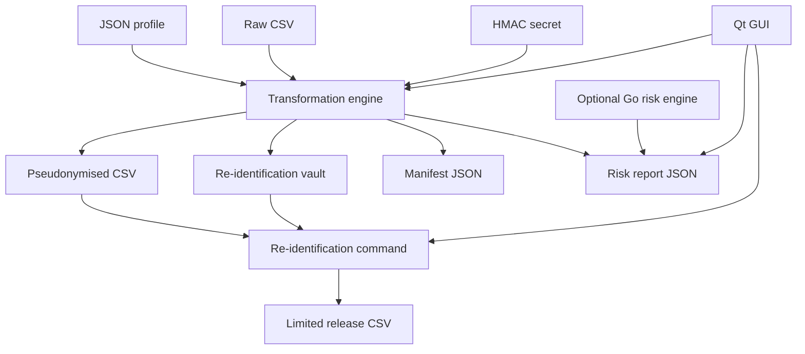

# Architecture

## Design Goal

Pseudonymity is designed as a configurable pseudonymisation pipeline rather than a single hard-coded demo script.

The main architectural decision is to keep policy, execution and recovery separate:

- policy lives in JSON profiles;
- execution lives in the Python engine;
- recovery lives in the vault workflow;
- interaction lives in thin CLI and GUI layers;
- risk screening can run in Python or through the optional Go component.

That separation makes the project easier to review. Privacy engineers can inspect the profile, data engineers can run the pipeline, security teams can focus on key and vault boundaries, and application teams can embed the library without copying CLI code.

The architecture separates five concerns:

1. input schema validation;
2. column-level transformation policy;
3. cryptographic token generation;
4. vault-backed re-identification;
5. accountability and residual-risk reporting.
6. optional native GUI workflows over the same library API.

## Components

## Profile Model

The profile controls the behaviour of the engine.

Key sections:

- `required_columns`: schema gate for input CSVs.
- `subject_id`: source field and HMAC settings for the primary subject pseudonym.
- `vault.include_original_fields`: original fields retained for authorised re-identification.
- `rules`: ordered column-level transformations.
- `risk.quasi_identifier_sets`: field combinations used for k-anonymity-style screening.

This keeps the code stable while allowing different datasets or policies.

## Reversibility Model

The project supports governed reversibility through a vault.

HMAC tokens are not decryptable. Re-identification happens by joining the pseudonymised dataset with `vault/reidentification_vault.csv` using `subject_pseudo_id`.

This model is deliberately aligned with the GDPR idea that additional information must be kept separately and protected by technical and organisational measures.

## Trust Boundaries

| Asset | Risk if exposed | Required production controls |
| --- | --- | --- |
| Pseudonymised dataset | Linkage and singling-out may still be possible. | Minimisation, access control, risk screening, retention. |
| HMAC key | Candidate values can be tested against tokens. | KMS/HSM, rotation, least privilege, audit. |
| Vault | Direct re-identification. | Encryption, RBAC, approval workflow, logging, monitoring. |
| Manifest | Reveals transformation policy and key source metadata. | Internal distribution control. |
| Profile | Reveals protection strategy. | Review and change control. |

## Why Not Promise Every Technique

ENISA discusses a broad technique space, including advanced approaches such as asymmetric encryption, group pseudonyms, chaining modes, multi-identifier pseudonyms, proofs of knowledge and secure multi-party computation. A serious tool should expose implemented, tested techniques and document future work separately.

This project therefore implements a strong practical baseline and keeps advanced PETs in the roadmap until implemented with mature libraries and a clear threat model.

## Python Library Boundary

The package is intentionally modular so downstream applications can import only what they need:

- `pseudonymity.engine.pseudonymise_dataset` for batch processing;
- `pseudonymity.vault.reidentify_dataset` for controlled recovery;
- `pseudonymity.risk.build_risk_report_from_csv` for standalone screening;
- `pseudonymity.techniques` for testing or extending transformations.

The CLI is a thin layer over these modules.

## GUI Boundary

The optional Qt GUI is also a thin layer over the same Python API. It does not implement separate pseudonymisation logic; it calls `pseudonymity.engine`, `pseudonymity.vault` and `pseudonymity.inspect`. This keeps CLI, library and GUI behaviour aligned.

The GUI is intentionally local-first. It is useful for seminars, privacy reviews and workstation workflows, but it should not be mistaken for an access-control system. If re-identification is used in production, governance belongs around the vault and audit trail, not only in the desktop application.

## Go Boundary

The Go component is deliberately small and stateless. It reads a pseudonymised CSV plus quasi-identifier sets and returns a JSON report. Python owns orchestration; Go is an optional acceleration/isolation point for future heavier risk analysis.
