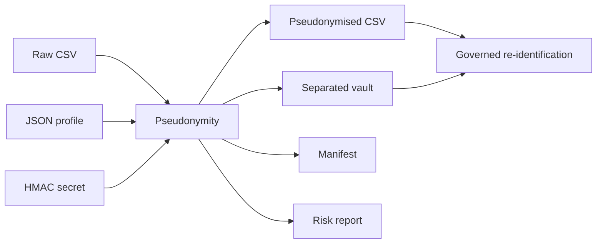

# ENISA And GDPR Pseudonymisation Formalisation

## Purpose

This document explains how Pseudonymity maps technical pseudonymisation controls to GDPR concepts and ENISA privacy-engineering guidance.

The important framing is that Pseudonymity does not treat pseudonymisation as a one-way technical trick. It treats it as an accountable processing pattern: identify the field, choose a proportionate transformation, preserve only the required utility, separate additional information, and make re-identification a governed event.

Pseudonymity demonstrates a complete pseudonymisation workflow:

1. generate or ingest a structured personal-data CSV;
2. transform direct identifiers and quasi-identifiers according to a profile;
3. keep additional information in a separated vault;
4. document the transformation through a manifest;
5. screen residual singling-out risk through configured quasi-identifier sets;
6. support governed re-identification through vault lookup.

The output is not anonymised data. Pseudonymised data remains personal data where attribution to a natural person remains possible through additional information or reasonably available means.

## GDPR Mapping

| GDPR reference | Impact on Pseudonymity |
| --- | --- |
| Article 4(5) | Pseudonymisation requires that data cannot be attributed to a data subject without additional information, and that additional information is kept separately with technical and organisational measures. |
| Recital 26 | Pseudonymised data that can be attributed with additional information remains data relating to an identifiable person. |
| Recital 29 | Separation of additional information and control of authorised persons are core parts of the model. |
| Article 5 | Profiles, manifests and risk reports support minimisation, purpose limitation, storage limitation, integrity/confidentiality and accountability. |
| Article 24 | Controllers must implement and be able to demonstrate appropriate technical and organisational measures. |
| Article 25 | Pseudonymisation is a data protection by design and by default measure. |
| Article 32 | Pseudonymisation is explicitly listed among possible security measures, alongside encryption and broader risk-based controls. |
| Article 89(1) | In research or statistical contexts, pseudonymisation can be a safeguard when combined with minimisation and other controls. |

## ENISA-Inspired Engineering Principles

ENISA repeatedly stresses that pseudonymisation is contextual: technique selection depends on purpose, utility, scalability, recoverability, adversarial model and re-identification risk.

Pseudonymity applies that view as follows:

| Principle | Implementation |
| --- | --- |
| Context analysis | The default e-commerce profile has explicit analytical goals and field-level treatment. |
| Separation of additional information | `output/pseudonymised_customers.csv` is separated from `vault/reidentification_vault.csv`. |
| Proportionate technique selection | HMAC-SHA256 tokenisation is used for deterministic linkability without exposing the original identifier. |
| Namespace separation | `subject`, `email`, `phone` and `ip` namespaces reduce accidental cross-domain correlation. |
| Utility preservation | Analytical fields can be retained, bucketed, masked, shifted or perturbed according to profile rules. |
| Linkage risk reduction | Birth dates, postcodes, IP addresses, dates and categories can be generalised. |
| Adversarial thinking | The risk report highlights small equivalence classes and possible singling-out signals. |
| Governed recovery | Re-identification is performed by authorised vault lookup, not by token decryption. |
| Accountability | The manifest records profile, techniques, field treatment, key source and output locations. |

## Architecture



## Field Treatment Example

| Raw field | Treatment | Output |
| --- | --- | --- |
| `customer_id` | Deterministic HMAC token | `subject_pseudo_id` |
| `first_name`, `last_name` | Removed from analytical output | Vault only |
| `email` | HMAC token plus optional masked display and domain | `email_token`, `email_masked`, `email_domain` |
| `phone` | HMAC token plus masked display | `phone_token`, `phone_masked` |
| `date_of_birth` | Generalisation | `birth_year`, `birth_decade`, `age_band` |
| `street_address`, `city` | Removed from analytical output | Vault only |
| `postal_code` | Geographic generalisation | `postal_area` |
| `last_login_ip` | HMAC token plus subnet generalisation | `ip_token`, `ip_subnet_24` |
| `signup_date` | Month bucket plus deterministic date shifting | `signup_month`, `signup_date_shifted` |
| `purchase_amount_eur` | Numeric band plus deterministic noise | `purchase_amount_band`, `purchase_amount_eur_noisy` |
| `diagnosis_code` | Category mapping | `diagnosis_group` |

## Threat Model

| Threat | Example | Mitigation in Pseudonymity |
| --- | --- | --- |
| Brute force | Trying sequential customer IDs. | HMAC with non-public secret. |
| Dictionary attack | Hashing known emails and comparing outputs. | HMAC instead of plain hashing. |
| Guesswork | Inferring people from age, region and purchases. | Generalisation and risk screening. |
| Linkage attack | Joining with external datasets. | Minimisation, broader buckets and quasi-identifier checks. |
| Insider vault misuse | Unauthorised lookup in the vault. | Separation by design; production systems need RBAC, approvals and audit. |
| Key compromise | Secret leaks allow candidate recomputation. | Production systems need KMS/HSM, rotation and strict access control. |

## Operational Checklist

- Define purpose, lawful basis and data roles before selecting techniques.
- Identify the controller, processors, vault administrators and analyst roles.
- Separate pseudonymised data, vault, raw data and key material.
- Use keyed tokenisation or encryption where appropriate; avoid plain hashes for predictable domains.
- Apply namespace separation and field-specific normalisation rules.
- Minimise direct identifiers and unnecessary quasi-identifiers.
- Assess re-identification risk using plausible attacker models.
- Document decisions, parameters, versions, access paths and review dates.
- Define separate retention policies for raw data, vaults, keys and analytical outputs.
- Treat pseudonymisation as a privacy and security measure, not as an exemption from GDPR obligations.

## CLI Example

```powershell
python .\pseudonymise.py demo --rows 120 --reference-date 2026-06-14 --profile .\profiles\ecommerce.json --risk-engine auto
```

Controlled re-identification:

```powershell
python .\pseudonymise.py reidentify --input .\output\pseudonymised_customers.csv --vault .\vault\reidentification_vault.csv --output .\output\reidentified_customers.csv --columns customer_id,email,phone
```

## Intentional Limits

Pseudonymity v1.0.0 does not yet implement encrypted vault storage, production RBAC, audit logs, key rotation, secure deletion, re-identification approval workflows or a complete DPIA. These should be designed with security, legal, DPO and business owners before operational use.

## Official Sources

- ENISA, "Pseudonymisation techniques and best practices", 3 December 2019: https://www.enisa.europa.eu/publications/pseudonymisation-techniques-and-best-practices
- ENISA, "Data Pseudonymisation: Advanced Techniques and Use Cases", 28 January 2021: https://www.enisa.europa.eu/publications/data-pseudonymisation-advanced-techniques-and-use-cases
- ENISA, "Deploying Pseudonymisation Techniques", 24 March 2022: https://www.enisa.europa.eu/publications/deploying-pseudonymisation-techniques
- ENISA, "Data Protection Engineering", 27 January 2022: https://www.enisa.europa.eu/publications/data-protection-engineering
- ENISA, "Engineering Personal Data Protection in EU Data Spaces", 2024: https://www.enisa.europa.eu/publications/engineering-personal-data-protection-in-eu-data-spaces
- Regulation (EU) 2016/679, EUR-Lex: https://eur-lex.europa.eu/legal-content/EN/TXT/?uri=CELEX:32016R0679
